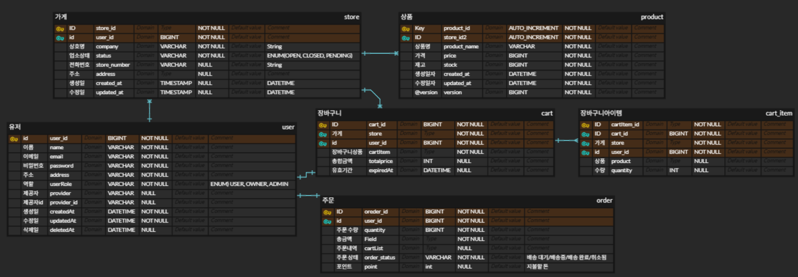
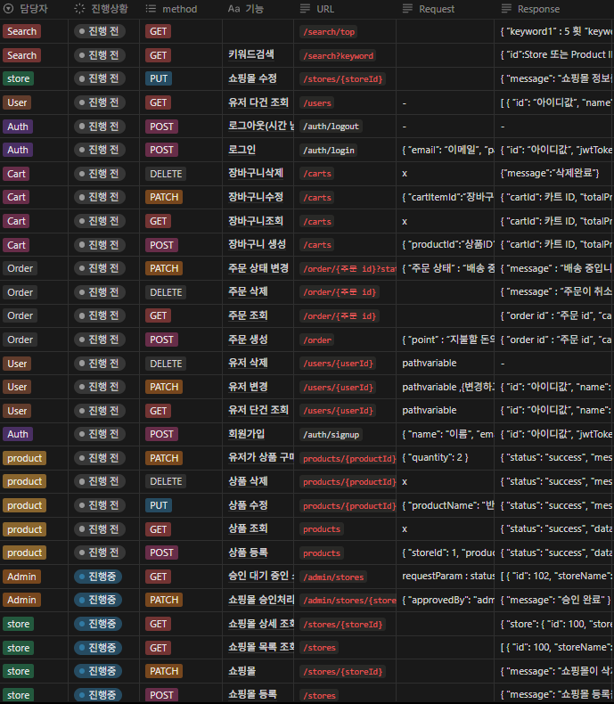

# ClothsDaNaWa

## 프로젝트 소개

쇼핑몰 애플리케이션 프로젝트<br>
다양한 의류 상품을 빠르게 탐색하고 구매할 수 있는 의류 전문 쇼핑몰 플랫폼
***

## 역할 분담

**오병택**<br>
유저 도메인, 인증 인가(security + jwt + oauth), 예외처리<br>

**박주형**<br>
쇼핑몰 도메인, AWS CI/CD<br>

**정이슬**<br>
상품 도메인, 재고 컬럼 (동시성 제어 - AOP + 분산락)<br>

**윤소현**<br>
주문 도메인, 쿼리 최적화 (INDEXing)<br>

**류형철**<br>
장바구니 도메인, 실시간 인기검색어(Redis)<br>

<br>

***

### 주요 기능 흐름

1. **로그인**
    - **OAuth 로그인**(Google, Kakao, Naver 등) 또는 **자체 회원가입 로그인**
    -
2. **가게 등록 & 승인**
    - `OWNER` 권한을 가진 사용자만 쇼핑몰(가게) 생성 가능
    - 생성 시 상태는 `PENDING` (관리자 승인 전에는 노출되지 않음)
    - `ADMIN` 권한 관리자가 `OPEN`으로 승인하면, 실제 고객에게 가게가 공개됨
    -
3. **상품 관리**
    - 승인된 가게에 상품 등록 및 가격·재고 수량 설정
    - `Soft Delete` 방식으로 상품 삭제 처리
    -
4. **장바구니 & 주문**
    - 사용자는 여러 가게의 상품을 **장바구니**에 담을 수 있음
    - 주문 시 **포인트 차감**(장바구니 금액만큼) → 주문 완료되면 해당 가게의 재고 수량 차감
    -
5. **검색 & 인기 키워드**
    - **쇼핑몰 이름** 또는 **상품명**으로 키워드 검색 제공
    - 검색에 사용된 키워드는 **실시간 인기 검색어** 집계 로직에 반영  
      <br>

***

## ERD


<br>

## 와이어 프레임


<br>

## API 명세서


<br>


<br>

## 기술 스택

### 🛠 Tech Stack

#### 🧩 Backend


#### 🗄 Database


#### ⚙ DevOps / Infra


#### 🔧 형상관리


#### 🤝 협업 도구


<br>

## 프로젝트 구조

```bas
ClothsDaNaWa/
├─ src/main/java/com/example/clothsdanawa
│  ├─ auth/          # 인증·인가 (JWT, OAuth2)
│  ├─ common/        # 예외처리, JWT 유틸, 보안 설정
│  ├─ config/        # JPA 설정, 스케줄러 등
│  ├─ product/       # 상품 도메인
│  ├─ store/         # 스토어 도메인
│  ├─ search/        # 검색 서비스 (Redis 활용)
│  ├─ cart/          # 장바구니 서비스
│  ├─ order/         # 주문 처리 서비스
│  └─ ClothsDaNaWaApplication.java
├─ src/main/resources
│  └─ application.properties  # 환경 설정
└─ docker-compose.yml         # Redis 컨테이너 설정
```

### 개발 규칙

* 코딩 컨벤션: Naver Java Coding Convention 준수


* GitHub 브랜치 전략:
    * main: 배포용 브랜치
    * dev: 개발 통합 브랜치
    * feat/<기능명>: 기능 개발 브랜치


* Pull Request 규칙:
    * 최소 2명 이상의 리뷰어 승인 필요
    * 리뷰 승인 후에만 PR 병합


* GitHub 업로드 전략:
    * main, dev, feat 브랜치로 나누어 커밋 및 푸시 관리

<br>